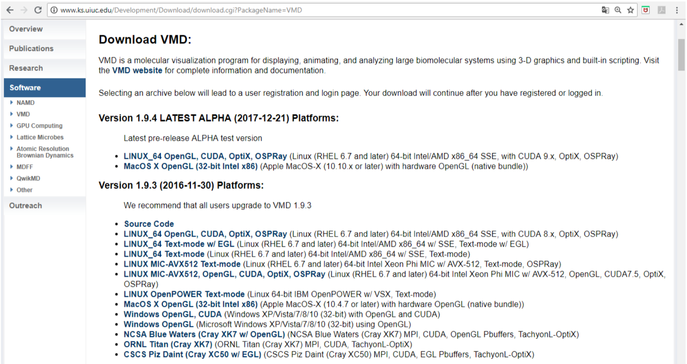
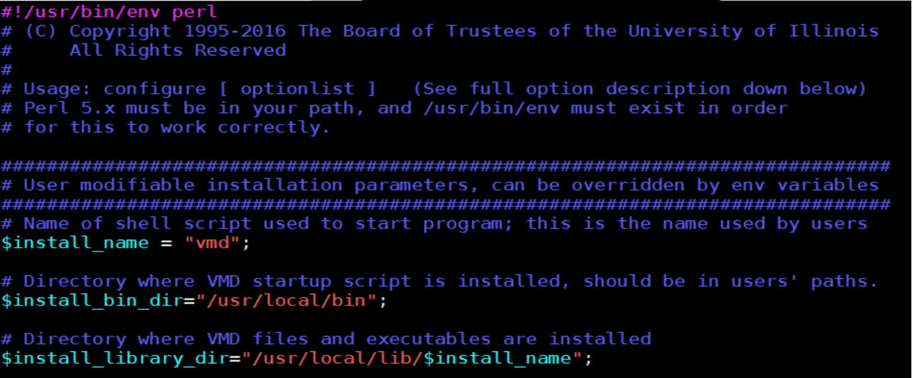
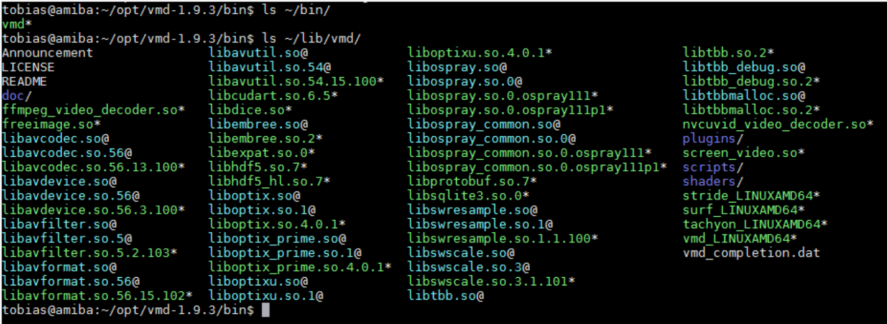
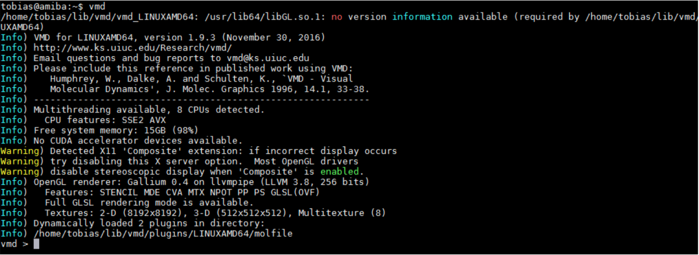

# Visualización *VMD*
**Agosto 2018**

Dr. Eduardo Jardón
Departamemto de Recursos de la Tierra
División de Ciencias Básicas e Ingeniería UAM-Lerma

M. en C. Tobías Portillo Bobadilla
Red de Apoyo a la Investigación, UNAM en el Instituto Nacional de Ciencias Médicas y Nutrición Salvador Zubirán
http://rai.unam.mx 

Ejercicio 1. [Representación del ADN][1]
Ejercicio 2. [Generación de una imagen de alta resolución][2]


## Introducción

A partir de la elucidación de la estructura del ADN y de la mioglobina, hacia mediados del siglo XX, las ciencias biológicas incorporan detalles del comportamiento atómico para estudiar la estructura y la función de las biomoléculas. La búsqueda de relaciones estructura-función surge
como una estrategia para describir al funcionamiento de la célula a nivel molecular. Así, por ejemplo, la especificidad de una enzima por su sustrato, o de un receptor por su efector, se deduce a partir del acoplamiento tridimensional en el complejo. Por lo tanto, la determinación estructural de biomoléculas a escala atómica es esencial para identificar interacciones, conformaciones o dominios que probablemente intervienen en su función. Principalmente la difracción de rayos X y la resonancia magnética nuclear (NMR) son los métodos que permiten resolver estructuras con resolución atómica. Por medio de la NMR, además, se conoce información sobre la flexibilidad propia de la biomolécula, es decir, del movimiento de dominios estructurales sensibles al ambiente molecular, como puede ser el disolvente. Sin embargo, la cantidad de estructuras depositadas en el Protein Data Bank ( 140 mil) representa una pequeña fracción de la cantidad de secuencias caracterizados y depositadas en el GenBank (~209 millones). La brecha estructural entre las secuencias y las estructuras tridimensionales conocidas es resultado de la dificultad para resolver la disposición espacial de los átomos. Como una estrategia para reducir la brecha estructural se usan cada vez más herramientas computacionales
que, hoy en día, permiten generar modelos a partir de secuencias homólogas (similitud > 30 %) y/o identificar cambios conformacionales asociados a la función biológica. En este tutorial se muestran algunos ejemplos con la secuencia de comandos (paso a paso) para visualizar
estructuras de proteínas, generar una caja de simulación, ejecutar NAMD para generar una trayectoria de simulación y realizar un análisis preliminar de la trayectoria.


## Visual Molecular Dynamics (VMD)

El VMD (Visual Molecular Dyamics) es un programa de distribución gratuita para instituciones educativas. El procedimiento para su instalación se describe a continuación.

**Instalación en Linux**

**DESCARGA**. Visita la pagina [http://www.ks.uiuc.edu/Research/vmd/][]. Se requiere el registro para iniciar la descarga de VMD.

[http://www.ks.uiuc.edu/Research/vmd/]: http://www.ks.uiuc.edu/Research/vmd/


Figura 1. Página de descarga de VMD

[http://www.ks.uiuc.edu/Development/Download/download.cgi?PackageName=VMD][]

[http://www.ks.uiuc.edu/Development/Download/download.cgi?PackageName=VMD]: http://www.ks.uiuc.edu/Development/Download/download.cgi?PackageName=VMD

Está disponible la Version 1.9.3 (2016-11-30) para múltiples plataformas. Elegimos la versión LINUX_64 OpenGL, CUDA, OptiX y OSPRay, lo que obtenemos es un archivo comprimido:

`vmd-1.9.3.bin.LINUXAMD64-CUDA8-OptiX4-OSPRay111p1.opengl.tar.gz`

> **NOTA:** *Conserva tu usuario y clave personal para posteriores actualizaciones. Te recomendamos guardar el archivo en tu directorio de trabajo o bien en una carpeta dedicada a las instalaciones. Usaremos el símbolo “ &gt;” para representar el cursor y “√” como símbolo de “presionar enter/return”. La tecla “tab” es muy útil porque completa los nombres de archivos, intenta: `ls vmd”tab” `*

```console
> ls vmd“tab”“√”
> ls vmd“tab”“tab”“√”
```

**CONFIGURACIÓN**

**Con Privilegios de Administrador**. Crear un directorio de instalación `/opt/vmd`, mover tu descarga a éste y cambiarte al mismo para descomprimirla e iniciar con la instalación:

> **NOTA:** Es común que debas escribir `sudo` al principio de cada instrucción. Esto se debe a que estás realizando tareas administrativas propias del superusuario. Debes proporcionar tu contraseña de usuario. Ten en cuenta que debes ser un usuario con permisos para usar `sudo`.

```bash
> mkdir /opt/vmd
> mv vmd-1.9.3.bin.LINUXAMD64-CUDA8-OptiX4-OSPRay111p1.opengl.tar.gz /opt/vmd/
> cd /opt/vmd
> tar zxvf vmd-1.9.3.bin.LINUXAMD64-CUDA8-OptiX4-OSPRay111p1.opengl.tar.gz
> cd vmd-1.9.3
> pwd
> ls
```

Figura 2. Comandos “pwd” y “ls” en la carpeta `/opt/vmd/vmd-1.9.3`.

**Configuración Personalizada sin Privilegios de Administrador**. Esta configuración requiere de más pasos pero no es necesario el `sudo` o ser root. Debemos editar el archivo `**configure**` para
definir los directorios donde se copiarán las librerías y los ejecutables. Primero creamos un directorio `~/opt` para guardar el archivo comprimido que hemos descargado y otro directorio `~/bin` para los archivos ejecutables. Descomprimimos con la instrucción `tar zxvf`.

Los comandos que usaremos a fin de organizar los archivos son: `mkdir` `cd` `mv` y finalmente `tar`.

```bash
tobias@amiba:~$ mkdir opt
tobias@amiba:~$ mkdir bin
tobias@amiba:~$ mv vmd-1.9.3.bin.LINUXAMD64-CUDA8-OptiX4-OSPRay111p1.opengl.tar.gz opt/
tobias@amiba:~$ cd opt
tobias@amiba:~/opt$ tar zxvf vmd-1.9.3.bin.LINUXAMD64-CUDA8-OptiX4-OSPRay111p1.opengl.tar.gz
```

```bash
> cd /home/tobias/opt/vmd-1.9.3/
> nano configure
```

Este último comando `nano` abre el archivo **`configure`** en el editor de textos. Los colores pueden variar. Otros editores comunes que puedes utilizar son `vim` o `sublime_text`.


Figura 3. Ventana para edición de archivo `**configure**`.

Las variables **`$install_bin_dir`** e **`$install_library_dir`** hacen referencia al directorio en donde se guardan los ejecutables de VMD. Debemos modificar estas variables cuando se realiza una instalación personalizada, o bien cuando no se cuentan con los prvilegios de *superusuario*.

Cambiar lo siguiente:

 ```bash
 /usr/local/bin
 ```
  por 
  ```bash
 /home/tobias/bin
 ```
 y cambiar también:
 
  ```bash 
 /usr/local/lib/$install_name
 ```
  por 
  ```bash 
  /home/tobias/lib/$install_name
  ```

> **NOTA:** En este ejemplo la cuenta del usuario es **tobias** y previamente se ha creado el directorio **bin** y **lib**. Hacer los cambios usando tu propio nombre de usuario.

Guardar y salir del editor. Existe un archivo `README` que contiene información más detallada sobre la instalación y cofiguración de VMD (sección: “*Quick Installation Instructions*”).

**INSTALACIÓN**

Debemos usar `sudo` si nuestra instalación es dentro del directorio `/opt`. Estando dentro del directorio `vmd-1.9.3` hacemos lo siguiente:

```bash
> ./configure
> cd src/
> make install
```


Figura 4. Comando make install

VMD installation complete. **Enjoy!!! Si todo fue exitoso**, se verán los siguientes archivos:


Figura 5. Salida del comando `ls` en el directorio personalizado `~/lib/vmd`. Si nuestra instalación no fue personalizada los archivos estarán en el directorio `/usr/local/lib/vmd/`

> **NOTA:** Observa que la instalación personalizada fue relizada para el usuario **tobias**. En la instalación con provilegios de administrador **no fue necesario editar** el archivo configure.

Regresamos al directorio de inicio (`~/` o bien específicamente `/home/tobias/`)

```bash
> cd
```

**CONFIGURACIÓN DEL PATH**

En el caso de la instalación personalizada es necesario incluir la ubicación de nuestra nueva aplicación en la variable de entorno **PATH**. Tomando como ejemplo la cuenta de **tobias**, se
procede de la siguiente forma:

```bash
> echo $PATH
```

Figura 6a. El valor de la [variable de entorno][] **PATH** se despliega con `$PATH`. Las diferentes ubicaciones están separadas por **`:`**

[variable de entorno]: [https://bioinf.comav.upv.es/courses/unix/variables_de_entorno.html]

Observamos los diversos directorios en donde el sistema ubica a los programas de Linux. Lo que haremos es agregar nuestro directorio `~/bin` al **PATH**:

```bash
> PATH=/home/tobias/bin:$PATH
> export PATH
> echo $PATH
```
Hemos exportado la nueva configuración para que tenga efecto inmediato. Al exportar la variable PATH al ambiente Linux el sistema reconoce los ejecutables que en esos directorios se almacenen. En adelante, cualquier archivo o código que pongamos en `~/bin` será reconocido como un *comando* o programa del sistema. Nuevamente usamos `echo` para mostrar el valor del **PATH**.


Figura 6b. Variable de entorno PATH actualizada con la ubicación de nuestra aplicación VMD.

> **NOTA:** Para que el nuevo PATH se guarde de forma permanente es necesario editar el archivo **.bashrc** ubicado en el directorio de inicio del usuario. El punto al inicio del nombre indica que es un archivo oculto, lo podemos verificar con `ls -a ~/.bashrc`. 

**Editar archivo `~/.bashrc`**

Para una configuración permanente del **PATH** agregamos en el archivo `~/.bashrc` la línea: `export PATH=/home/tobias/bin:$PATH`. O bien **si no existen `~/.bashrc` ni `~/.bash_profile`** los podemos generar desde una terminal:

```bash
> echo 'export PATH="/home/tobias/bin:$PATH"' >> ~/.bashrc
> echo 'source ~/bashrc' >> ~/.bash_profile
```

**EJECUCIÓN DE VMD**

Desde una terminal del sistema operativo (shell):

```bash
> cd mi_directorio_de_trabajo
> vmd
```


Figura 6. Consola de VMD.

> **NOTA:** El directorio de trabajo es cualquiera. La instalación de **vmd** en este caso se hizo en `/home/tobias/bin` y sus librerías están en `/home/tobias/lib/vmd/`.

Al iniciar **vmd** se despliegan otras dos ventanas (VMD OpenGL Display y VMD Main)

Figura 7. Ventana Open GL (A) y ventana Main (B)

**Abrir una estructura PDB desde la terminal**

Los archivos que se pueden abrir con VMD son aquellos que continene información sobre las coordenadas de los átomos de o una molécula, comúnmnete archivos como los que se pueden encontrar en el **Protein Data Bank** (PDB). Podemos descargar un archivo de este tipo directamente del sitio web, por ejemplo **3NIR.pdb**. Para ello usamos el comando `wget`:

```bash
> wget https://files.rcsb.org/view/3NIR.pdb
> vmd 3NIR.pdb
```


# Referencias


[1]: ./ejercicio1.md
[2]: ./ejercicio2.md
